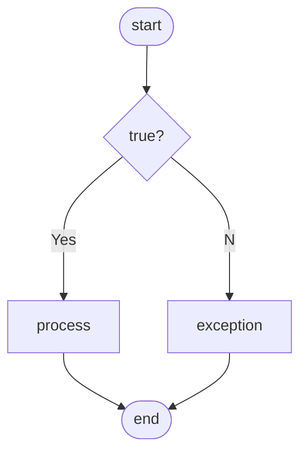

## Contents

## What is a Mermaid?

ふとした瞬間、不意にフローチャートやシーケンス図、クラス図が書きたくなるときってあるよね？(え、ないって？)

ということで、ダイアグラムやチャート作成できるツール=JSライブラリの[Mermaid](https://mermaid.js.org/)を、このブログ記事を書いているMDXファイルフォーマット内で書けるようにしたので、導入手順を振り返ってみたい。

フローチャート図の例

## Astro&MDXへの導入手順

以下のURLの「Quick start」を参考にmdx-mermaidをAstroに導入した。一部ドキュメント通りだとうまく動かなかった部分があったので、その詳細については追記する。

https://github.com/sjwall/mdx-mermaid

後日更新。
